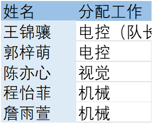
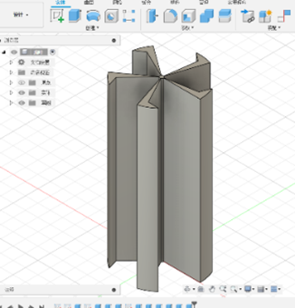
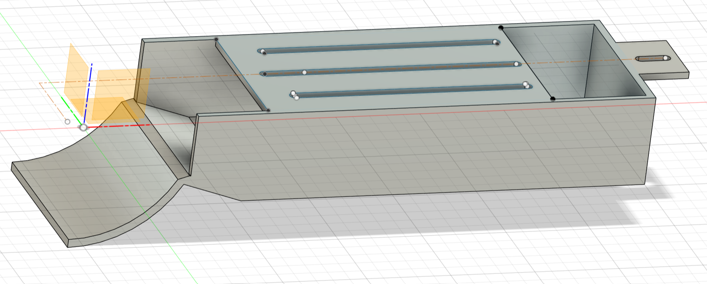
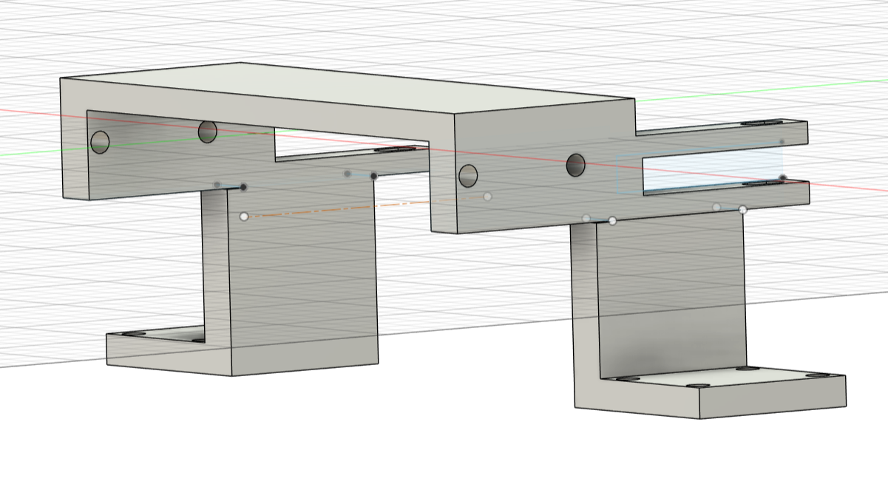
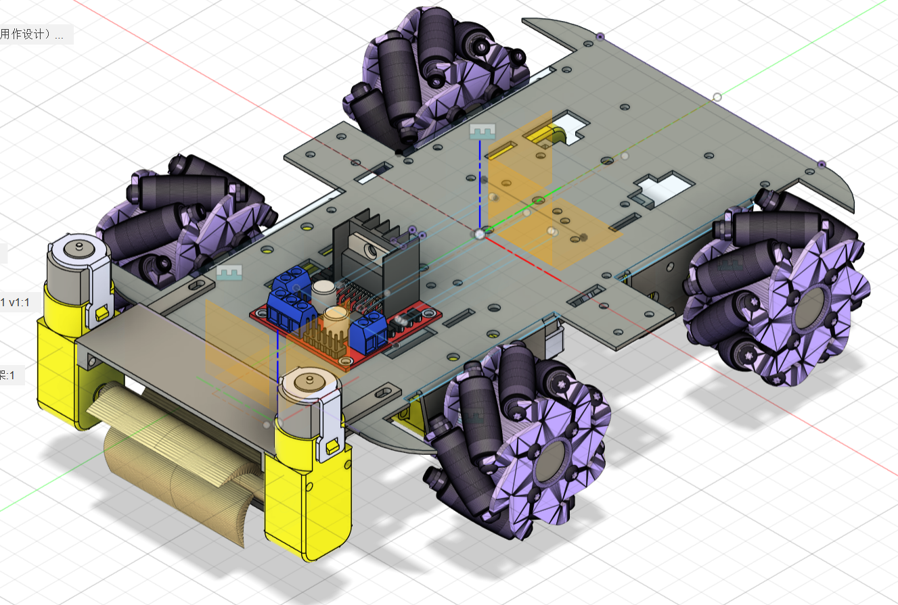
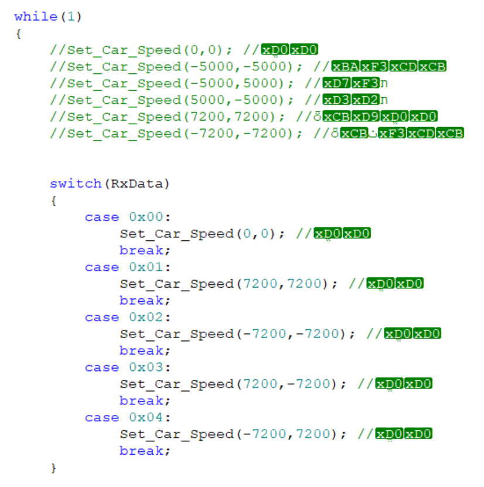
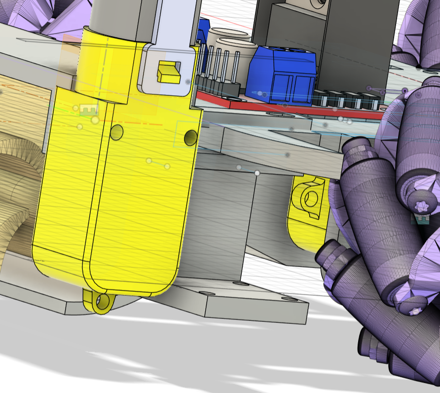
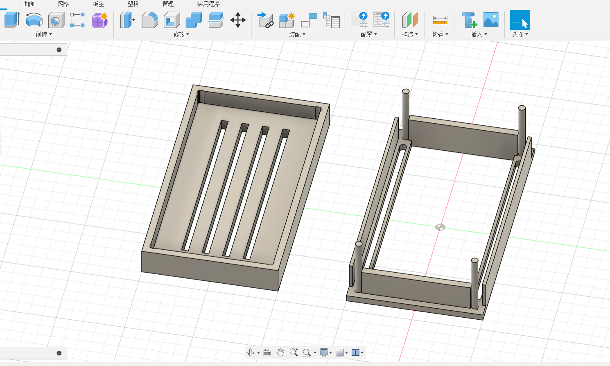
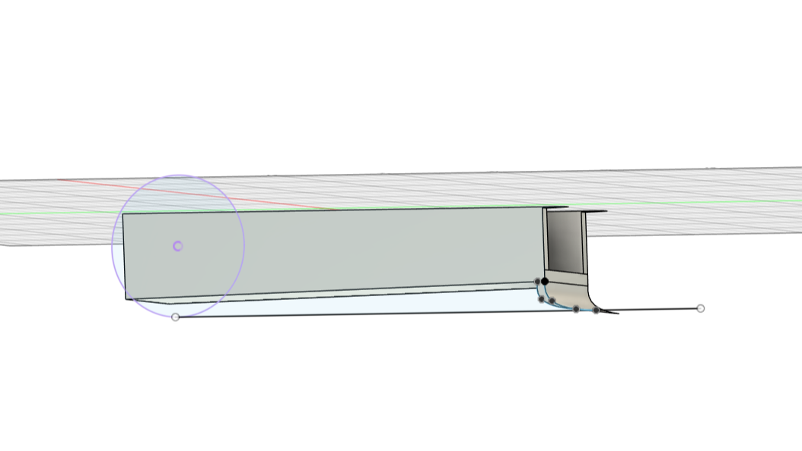

# 智能小车设计与开发日志（2025.9.26-2025.10.25）
## 一、项目前期规划（2025.9.26-2025.10.6）
1. **工作分配**：明确各组员个人任务与团体任务，同步开展自我学习，具体分工详见对应图示。

2. **共同学习目标**
   - 设计具备“携带、收集、转移”三大核心功能的机器智能小车。
   - 根据设计图纸完成小车搭建与功能测试。
   - 持续优化小车功能，完成功能更新与加强。

## 二、小车一开发日志
### （一）功能分析与方案确定（2025.10.11）
#### 1. 携带功能（1.0版本）
- **功能目标**：实现收集到的小球暂时储存。
- **设计方案**：采用大空间容器作为小球容纳装置。

#### 2. 收集功能（方案对比与确定）
- **功能目标**：识别并拾起地面小球、识别空中掉落小球并移动收纳。
- **方案一：网球收球器式机械装置**
  - 具体方案：机器人通过旋转、行进寻找小球，将角度数据传输给单片机；单片机控制机器人旋转对准小球后，直线前进将小球收纳至容器。
  - 优点：马达驱动扇叶可控速，转动快，可收纳多个小球，效率高。
  - 缺点：增加2个马达导致小车重量上升，前端重量过大可能引发结构重心不稳。

- **方案二：机械臂夹取装置**
  - 具体方案1（视觉控制）：传感器定位小球后传输数据给机械臂，机械臂通过连杆传动装置实现夹取。
    - 优点：单个夹取精度高。
    - 缺点：效率极低，不适用竞速场景；机械臂设计与控制复杂；夹取球形物体易滑动掉落。
  - 具体方案2（PS2手柄控制）：通过PS2手柄控制机械臂转动、伸缩与夹取。
    - 优点：精准性高。
    - 缺点：PS2手柄经济性差，成本高；同方案1存在效率低、设计复杂问题。

- **方案三：铲土机式结构**
  - 具体方案：小车前端安装铲土式结构，铲起小球后沿轴旋转，将小球倒入容器。
  - 优点：可一次性铲取多个小球，效率高；设计有现实案例参考，难度较低。
  - 缺点：前端无阻挡时，小球易被小车推走而非进入容器，方案合理性需进一步验证。

- **方案综合分析与确定**：优先满足“规定时间内收纳更多小球”的核心目标，方案二虽精准但效率低、设计难度高，故最终选取**方案一**作为收集功能实现方案，即“收集1.0版本”——通过扇叶旋转带动小球进入收纳盒。

#### 3. 当日总结
完成小车核心功能分析，初步设计功能实现装置；各组员提出建设性方案，经优缺点对比与综合评估，确定收集功能最终方案。

### （二）技术学习与功能优化（2025.10.12）
#### 1. 核心技术学习
- 学习3D打印技术原理，掌握根据热胀冷缩特性调整打印尺寸的方法。

#### 2. 功能版本更新
- **携带1.0.1版本**：更新小车一容器尺寸，适配小球储存需求。
- **收集1.1版本**：初步设计4个扇叶旋转结构，采用2个TT马达驱动；扇叶处制作回勾形式，辅助小球进入收纳容器。
- **小车运动功能1.0版本**：采用麦轮（AABB型），通过不同PWM输出实现左转、右转、直线、后退行驶，麦轮由TT马达驱动。

#### 3. 麦轮运动系统细节
- **麦轮结构**：由斜向排列辊子组成，4个电机驱动可实现前进、后退、平移（左/右）、旋转等全方位运动。
- **电机布局**：4个电机分别驱动左前（LF）、右前（RF）、左后（LB）、右后（RB）麦轮，辊子倾斜方向对称（左轮斜向右，右轮斜向左）。
- **运动控制逻辑**
  - 前进：4个电机均正转。
  - 横向左移：LF反转、RF正转、LB正转、RB反转。
  - 顺时针旋转：左轮正转、右轮反转。

#### 4. 具体代码分析
- **电机与PWM初始化**：通过GPIO引脚（IN1/IN2）控制电机正反转；使用TIM2和TIM3的4个通道生成PWM信号，周期1ms（1kHz），占空比（0-100%）控制转速。
- **麦轮运动逻辑**：通过电机转向组合合成不同运动方向，如前进/后退依赖电机同向转动分力，横向移动依赖对角线电机反向分力叠加。
- **指令映射**：通过字符指令（'F'/'B'/'L'/'R'等）对应运动模式，可结合蓝牙/无线模块接收外部控制指令。

#### 5. 问题与解决方案
| 问题类型 | 原因分析 | 解决方案 |
|----------|----------|----------|
| 运动方向偏移（如前进跑偏） | 1. 电机转速不一致（个体差异、电压分配不均、程序错误） 2. 麦轮安装角度偏差（辊子倾斜不对称、马达固定不牢） 3. 地面摩擦不均（小车配重失衡） | 1. 校准电机速度，为每个电机添加补偿系数（如LF速度=设定值×0.95） 2. 重新安装麦轮，确保辊子倾斜对称；用螺丝+胶枪固定马达与底盘 3. 调整零件分布，使重心居中，避免单侧压力过大 |
| 横向移动卡顿/无力 | 1. 电机功率不足（横向移动扭矩需求高） 2. PWM频率过低或占空比不合理 3. 线路凌乱缠住轮子 | 1. 更换大功率电机（600rpm以上减速电机），使用7.4V锂电池保障电压稳定 2. 提高PWM频率至1-2kHz，横向移动速度限制在50-70% 3. 整理固定线路，避免缠绕轮子 |
| 旋转时偏心 | 1. 4个电机转速不匹配，旋转中心偏移 2. 小车重心不在几何中心 | 1. 校准旋转时电机速度，确保左侧/右侧电机转速分别一致 2. 调整电池等重物位置，使重心与旋转中心重合 |

#### 6. 当日总结
掌握3D打印技术核心要点，完成小车容器尺寸、收集装置结构优化；明确麦轮运动系统设计细节与代码逻辑，解决运动控制关键问题。

### （三）细节优化与功能完善（2025.10.13）
#### 1. 功能版本更新
- **携带1.0.2版本**：在收集扇叶下方增加弯曲部件（用于兜住小球），并与小车一容器连接。
- **收集1.2版本**：根据小球直径调整，更新为5个扇叶旋转结构，加大扇叶回勾尺寸（具体规划详见图示）。

#### 2. 当日总结
对小车关键部件进行细节补充与调整，进一步完善收集、携带功能的实用性与稳定性。

### （四）结构设计与控制方案确定（2025.10.14-2025.10.20）
#### 1. 功能版本更新
- **携带1.1版本**：为方便小球取出与后续维护，设计收集装置可拆卸结构；依托底板已有中线孔，实现收纳装置与底盘连接（具体设计方案详见图示）。

- **收集1.2.1版本**：设计扇叶转动结构——通过中间轴与马达刚性连接实现转动，结合马达模型确定轴为“腰型孔”结构。
- **收集1.2.2版本**：设计马达与整车连接支架，实现马达稳固安装（具体设计详见图示）。

#### 2. 无线电控制方案确定（1.0版本）
- **方案一：PS2手柄控制**
  - 优点：有对应课程支持，答疑方便，操作简单。
  - 缺点：经济性差，成本高。
- **方案二：蓝牙模块+手机控制**
  - 优点：成本低、体积小、操作便捷。
  - 缺点：无见习队伍教学支持，操作难度较大。
- **方案确定**：选择蓝牙模块方案，购置HC-06蓝牙模块，通过网上教程自学实现手机控制。

#### 3. 整车设计1.0版本
完成整车初步建模设计（具体细节图详见图示）。

#### 4. 当日总结
确定小车驱动与控制方案，完成物资购置；优化收集、携带装置结构设计，完成整车初步建模。

### （五）功能实现与结构调整（2025.10.21-2025.10.23）
#### 1. 无线电控制2.0版本（蓝牙控制实现）
- **核心逻辑**：通过HC-06蓝牙模块实现手机与STM32无线通信；STM32接收指令后控制电机驱动模块，实现小车前进、后退、转向、停止等功能。
- **控制流程**：手机APP发送指令（字符/字节）→蓝牙模块接收→STM32解析指令→输出PWM信号控制电机。
- **具体实现步骤**
  - **USART初始化**：波特率与蓝牙模块一致（避免通信中断）；TX引脚（PA2）配置为GPIO_Mode_AF_PP，RX引脚（PA3）配置为GPIO_Mode_IN_FLOATING。
  - **数据收发逻辑**：发送函数（Bluetooth_SendByte）通过等待USART_FLAG_TXE标志确保数据发送；接收函数（Bluetooth_ReceiveByte）通过等待USART_FLAG_RXNE标志，增加超时机制避免程序卡死。
  - **透传模式特点**：无需解析蓝牙协议，直接通过串口函数收发数据，相当于“无线串口线”。
  

- **常见问题与解决方案**
  | 问题类型 | 原因分析 | 解决方案 |
  |----------|----------|----------|
  | 通信异常（收不到数据） | 1. 波特率不匹配 2. TX/RX接线错误（接反或未共地） 3. 模块未上电（VCC电压错误） 4. 模块损坏或未配对 | 1. 用AT指令查询模块波特率，确保与程序一致 2. 交叉接线（STM32 TX接蓝牙RX，STM32 RX接蓝牙TX），必须共地 3. 确认模块电压（如HC-05需3.3V，部分兼容5V） 4. 更换模块或重新配对 |
  | 接收数据丢包/不完整 | 1. 阻塞式接收导致主程序卡顿 2. 数据发送过快，接收缓冲区溢出 3. 无线信号弱或有干扰 | 1. 改为“中断+DMA”接收方式，避免主程序阻塞 2. 定义数据帧格式（如用\r\n作为结束符），判断帧完整性 3. 靠近模块测试，避免金属遮挡 |

#### 2. 小车运动功能1.1版本（上下坡问题优化）
- **问题分析**：小车底盘低（最小离地间隙约60mm）、接近角大（前轮中心到车头距离大），上坡时易被卡住或托底（坡比0.5需接近角预留5°以上）。
- **限制条件**：无法大改现有设计（缩减车头会影响接近角，加高底盘会影响扇叶拾球）。
- **解决方案**：购置迷你无动力辅助轮，上坡时辅助轮优先接触坡面，实现小车抬升与短前悬设计，增加有效接近角。

#### 3. 收集1.2.3版本
设计2个与辅助轮连接的连接装置，支架孔分别与底盘、马达固定连接。

#### 4. 整车设计1.1版本
完成修改后整车建模（具体细节图详见图示），方便后续尺寸调整。

#### 5. 当日总结
实现蓝牙控制功能，解决小车上下坡关键问题；完成整车建模优化，确保各部件适配性。

### （六）整车结构优化（2025.10.25）
#### 1. 核心问题与解决方案
- **问题**：蓝牙装置时常断连，需确保电路接触良好；外力作用下零件不散落、电线不断路，但底盘空间有限无法容纳所有零件。
- **解决方案**：设计双层结构支架（不超过小车限定高度），将电池盒、L298N、降压模块、STM32C8T6、蓝牙模块有序分布；采用榫卯连接、螺丝拧紧、胶枪连接三种方式固定部件（具体设计图详见图示）。

## 三、小车二开发日志
### （一）功能分析与方案确定（2025.10.14）
#### 1. 核心功能定位
- 核心实现“转移功能”：在场地边缘、地面拾取小球，比赛结束前将小球转移至小车一。

#### 2. 转移功能（1.0版本，方案对比与确定）
- **方案一：连杆驱动倾斜转移**
  - 具体方案：制作连杆结构，通过连杆驱动使小车二容纳装置抬升倾斜，将小球转移至小车一。
  - 优点：效率高，可一次性完成转移。
  - 缺点：连杆装置设计困难；抬升需较大活动空间（容纳装置需装在小车上方）；转移精度要求高（车辆方向、倾斜角度/高度需精准）。

- **方案二：开关门装置+小车一二次收集**
  - 具体方案：通过开关门装置使小车二落下小球，利用小车一收集装置二次收纳，最大化小车一储球量。
  - **开关门装置方案对比**
    | 开关门方案 | 具体设计 | 优点 | 缺点 |
    |------------|----------|------|------|
    | 方案一（轴旋转开合） | 沿轴旋转实现门的开合，需舵机驱动 | 材料简单（舵机+轴），设计难度低 | - |
    | 方案二（丝杆线性开合） | 丝杆+电机+活动轴+螺母块驱动门线性开合 | - | 材料复杂，需匹配丝杆长度，螺母块尺寸不适配 |
    | 方案三（电机连杆线性开合） | 电机驱动连杆实现门线性开关 | - | 材料复杂（连杆+活动轴+电机），需考虑活动空间、驱动力、磨损等问题 |
  - **开关门方案确定**：选取方案一，兼顾材料经济性、设计难度与可行性。

#### 3. 收集与携带功能（1.0版本）
暂采用小车一的收集、携带装置方案，后续同步更新。

#### 4. 当日总结
确定小车二核心“转移功能”实现方案，初步沿用小车一收集、携带装置设计。

### （二）功能同步更新（2025.10.16）
- **收集功能1.0.1版本**：同步更新小车二收集装置，与小车一保持适配。
- **携带功能1.0.1版本**：同步更新小车二携带装置，优化小球储存效果。

### （三）转移功能优化与程序实现（2025.10.17）
#### 1. 携带1.1版本
将收纳盒底部设计为向下倾斜结构，使小球可无动力从收纳装置后方落下，适配后续转移功能（具体设计图详见图示）。

#### 2. 转移1.1版本（舵机控制开关门实现）
- **核心逻辑**：通过舵机控制开关门装置，舵机需与蓝牙模块连接以实现定时控制；舵机通过PWM（脉冲宽度调制）信号控制角度。
- **具体实现步骤**
  - **定时器配置（TIM3）**：APB1时钟默认36MHz，通过TIM_Prescaler=719分频为50kHz；生成20ms周期PWM，ARR=999（周期=(ARR+1)/计数频率）；采用TIM_OCMode_PWM1模式（计数器值<比较值时输出高电平）。
  - **角度与比较值换算**：舵机脉冲宽度0.5ms~2.5ms对应比较值25~125；角度（0-180°）映射公式：`compare = 25 + (angle / 180) * (125 - 25)`。
  - **GPIO配置**：舵机PWM信号引脚配置为GPIO_Mode_AF_PP（复用推挽输出），确保TIM3_CH1信号从PA6引脚输出。

#### 3. 程序问题与解决方案
- **问题**：驱动能力不足（舵机有运动声音但无法转动）。
- **原因**：STM32引脚输出电流有限（最大20mA），无法满足舵机驱动需求。
- **解决方案**：为舵机提供独立5V电源供电。

